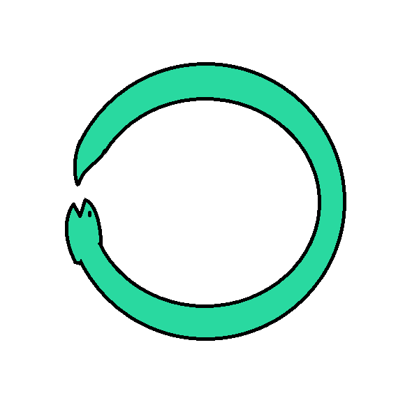

# Ouroboros.skill

**简体中文** | [English](README.en.md)

<div align="center">
  
  
  
  
  
  
</div>

<div align="center">
  
</div>

<div align="center" style="background-color: #1a1a2e; color: #eaeaea; border-radius: 12px; padding: 24px 16px; border: 1px solid #3a3a5e;">

# 🐍 Ouroboros · 递归唤醒驱动

🌙 **在每双没有梦的眼里，循环又循环。** 🐍 —— ilem《〇》

让 agent 一直干活，干不完还会叫醒自己继续干——直到目标真正完成。

</div>

Ouroboros **不是代码审查器**。它是让自主 agent **不停工作到完成**的递归驱动：托住一个 **goal（长期目标）**、把活**拆给 sub-agent**（代码审查交给 Camelot，审完接回）、并架一个 **timer（定时器）**——一旦 agent 停下、偷懒或中途搁置，**它会自己醒过来接着干**。

需要代码裁决时，Ouroboros **调用 Camelot**，自己从不亲自审代码。**Camelot 是刃，Ouroboros 是那只永不放手的推手。**

| | |
|---|---|
| 📄 格式 | Markdown 技能（frontmatter `SKILL.md`）+ `skill.json` 元数据 |
| 🧩 兼容 | Claude Code / Codex / DSH presets / 任何能加载 Markdown 技能的 agent |
| 🌏 语言 | 简体中文（README 默认）· 技能指令英文为主 |
| ⚖️ 许可 | MIT |

---

## 为什么需要它？

单次对话的 agent 会"说完就停"。要它**为一个不结束的目标持续产出**，需要三样东西，正好是衔尾蛇的三节：

1. **长期目标（goal）**——目标不随单轮结束而消失；中断了能从上次进度续上，而不是归零重来。
2. **分工（sub-agent）**——主 agent 不该是瓶颈：独立子问题拆出去并行/接力；**需要审代码时，派一个跑 Camelot 的子代理，把裁决接回主 context**。
3. **定时唤醒（timer）**——**agent 一旦没完成任务就偷懒/停摆，定时器会把它叫醒**，让它继续朝目标推进，而不是等人来戳。

## 三大引擎

### 1. goal —— 托住一个长期目标，agent 不因单轮结束而停
把不可回避的长期目标登记下来，循环不绑死在某一轮。每轮进度落进目标上下文；崩溃/被打断就从上次已提交处续跑，而非从零开始。**目标就是存在的理由**——产出漂离目标的回合是必须纠正的"致命偏航"。

### 2. sub-agent —— 分工，并把审查交给 Camelot
把独立工作派给子代理（一个模块 / 一片测试 / 一处根因深挖各一个），主 agent 不独揽：
- 需要裁决某轮代码时，**不**在主 agent 里亲自再审一遍——派一个**运行 Camelot 的子代理**审 diff，让它带回 Exile/Dishonor/Counsel/Valour 裁决与指令，**接回主 agent 的目标上下文**后再进下一轮。
- Ouroboros 编排"谁审、何时审"，**审查本身永远归 Camelot**。

### 3. timer —— 停了/偷懒，自己叫醒自己
Ouroboros 要杀死的失效模式就是：**agent 中途停下，无人续推。** 只要目标未达成：
- 在阻塞等待前、或 agent 本想把控制权交回时，架一个会再次触发本技能的**自醒定时器**；
- 醒来 → 读目标 → 读上一轮状态 → 决定 `proceed` / `halt` / `escalate`，**继续干到目标完成**，而不是干到"墙钟说差不多得了"；
- 防"忙碌式空转"：连续 N 次醒来都没有推进 → 应升级而非仅仅更响地循环。

**timer 让递归自我启动——这就是咬住自己尾巴、借以存活的衔尾蛇。**

## 递归循环协议

每轮产出一份紧凑状态记录（机器友好）。用你运行环境里真实的 goal / sub-agent / timer 工具（DSH goal · Claude Code 的 subagent/timer · Codex 的可续会话——有哪个用哪个）：

```
## 🔁 Ouroboros cycle N

goal_state:
  objective: "<长期目标>"
  status: incomplete | complete | blocked
  context_tail: "<上一轮已提交结果>"

delegation:
  - to_subagent: camelot      # 派 Camelot 审最新 diff
    result_callback: verdict  # 其裁决 + 指令接回目标上下文
  - to_subagent: <其他任务臂…>

wakeup:
  timer_armed: true
  next_wake_on: <事件 / 空闲前间隔>
  last_progress_commit: <目标进行到哪>

directive: proceed | halt_and_investigate | escalate_to_human
```

### directive —— 下一步怎么走

| 值 | 含义 | 何时 |
|---|---|---|
| `proceed` | **继续干**；架自醒定时器、派下一轮子代理 | 目标未达成且有推进 |
| `halt_and_investigate` | 暂停产出，深挖根因（或派子代理去读依赖源码）再重转 | 打地鼠 / 同类问题反复 |
| `escalate_to_human` | 停下交给真人 | 卡在只有人能定的事，或 3 轮无推进 |

默认偏向是 **`proceed`**：除非存在真实的 `halt`/`escalate` 理由，否则 agent 让自己保持被调度、持续工作——这就是递归的承诺。

## 防偷懒誓言

每轮 agent 都要如实回答：*我推进目标了吗，还是只是停着？*

1. **没有"够一轮就走"的出口**——目标没达成就是没完成；被打断的一轮不算完成。
2. **空闲前必须架好唤醒**——还有未完成工作却要停时，架定时器自己续，而不是等人来戳。
3. **审查交给 Camelot，不进循环**——主 agent 不悄悄亲自重审代码，它派发审查、消费返回的裁决。
4. **上下文结转**——已提交的进度才是下一轮续跑的位置；"上轮感觉做完了"不算数。
5. **忙碌式空转不是推进**——定时器一直在响却毫无收窄（同类问题），升级而不是更响地循环。
6. **验证胜过声称**——"有进展"要拿得出产物（diff / 日志 / 测试行），不是一句断言。

## 配套推荐

> **和 [Camelot.skill](https://github.com/Barinfo/Camelot.skill) 一起用效果更佳。** Camelot 是裁判（judge）——裁决某一轮代码配不配；Ouroboros 是驱动（driver）——让任务不断被推着走，需要裁决时把 Camelot 交给子代理、审完接回。若你还有 AI 交付前闸门（`pre-delivery-selfcheck` / D1–D12），三者可并列：Camelot 给判断、Ouroboros 给持续、交付闸管每次发出去干不干脆。

## 安装

```bash
# Claude Code
cp SKILL.md ~/.claude/skills/ouroboros/SKILL.md

# DSH 自定义 preset（替换 <id>）
cp SKILL.md ~/.dsh/.agent-presets/<id>/skills/ouroboros/SKILL.md
```

## 目录结构

```
Ouroboros.skill/
├── README.md                # 本文件（简中默认）
├── README.en.md             # English
├── skill.json               # 元数据：triggers、keywords、companion
├── SKILL.md                 # 技能本体——复制即安装
└── assets/
    └── snake.png            # 衔尾蛇视觉（原创绘制）
```

## 优点

1. **把"会不会做完"变成机制，而不是靠自觉**——goal 常存、timer 自醒，agent 停不下来装死。
2. **审查不重复**——代码裁决永远委派 Camelot，主 agent 不既当选手又当裁判。
3. **分工不阻塞**——sub-agent 并行/接力，主 agent 不当瓶颈。
4. **中断可续**——goal 让崩溃/打断从上次进度续跑，而不是归零。
5. **防偷懒成文**——"空闲前必须架唤醒"写在誓言里。
6. **与 Camelot 互补**——判断归它，持续归我。

## 诚实局限

1. **需要运行环境真的提供 goal / sub-agent / timer**——裸的纯文本 agent 没有这些机制时，效果打折。
2. **定时器要宿主支持**——不自带调度器；用宿主给的 timer 服务。
3. **"真把活干完"仍取决于模型的执行能力**——它能逼 agent 别停，但产出质量仍靠底层模型。
4. **英文为主的指令语气**，中文团队可自行本地化。
5. **防"空转"，不防"方向错"**——目标本身错了它不会纠正。

## 何时别用它

- 你只要单次代码审查 → 去 **Camelot**。
- 运行环境没有 goal/sub-agent/timer 可挂 → 它发挥不出递归驱动。
- 你其实想要情绪支持 → 这也不是该用的地方。

## 许可

[MIT](LICENSE) · © 2026 FuCube

*衔尾蛇图由作者 Barinfo 原创绘制，可随本技能自由使用。*
